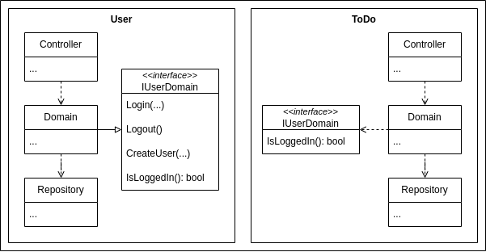

# todo-list-go
This Todo List project was created to demonstrate dependency injection and POO in Go.

It's built using a package definition based on the "package by resource" from Clean Architecture (Robert C. Martin), where each package defines a resource (or domain) of the system and contain all the code related to that, including controllers, the domain itself, repositories and anything exclusive to that package. 

This package definition allows us to avoid the global "utils" package that is not very clear and highly coupled, since is used abroad the whole system. Also let us start coding from the most important part of the system, the domain and its tests, before developing the rest of the code.

Besides this architecture allowing the development of each package separately, it also brings a "disavantage": if the complete interface perhaps change the signature of a method, it must be changed in all interfaces using that method. It's not that much trouble because when changing an interface signature, the classes using it will need refactoring anyway, the difference is that in this new dynamic, the project error will be on the dependency injection instead of the implementation. You just have to get used to changing more than one interface, if they change (they shouldn't unless strictly necessary).

> Implementations hidden and diagram simplified for clearance.